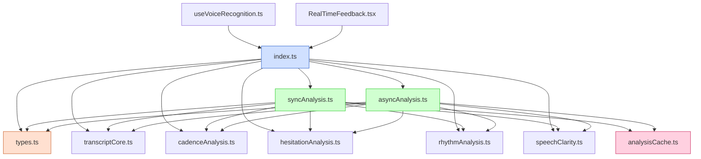

# Speech Analysis Module Structure

This document outlines the structure of the speech analysis module after refactoring into smaller, more focused files.

## Module Structure Diagram



## File Responsibilities

### Core Types and Interfaces
- **types.ts**: Contains shared type definitions including `SpeechAnalysisResult`, `SpeechAnalysisConfig`, and `ClarityScore`

### Analysis Modules
- **transcriptCore.ts**: Processes raw transcript text
- **cadenceAnalysis.ts**: Analyzes speech cadence and rhythm
- **hesitationAnalysis.ts**: Detects hesitations and stuttering
- **rhythmAnalysis.ts**: Analyzes rhythm patterns based on pauses and bursts
- **speechClarity.ts**: Evaluates clarity of speech with scoring

### Analysis Orchestration
- **syncAnalysis.ts**: Provides synchronous full speech analysis
- **asyncAnalysis.ts**: Provides asynchronous full speech analysis with parallel processing
- **analysisCache.ts**: Manages caching of analysis results for performance optimization

### Entry Point
- **index.ts**: Re-exports all types and functions from the refactored files for a clean public API

## Data Flow

1. User components like `RealTimeFeedback.tsx` or hooks like `useVoiceRecognition.ts` import functions from the entry point.
2. The analysis flow typically follows:
   - Import analysis functions from `index.ts`
   - Call either `analyzeFullSpeech` (sync) or `analyzeFullSpeechAsync` (async)
   - These orchestrators call individual analysis modules
   - Results are cached via `analysisCache.ts` when appropriate
   - The combined analysis is returned to the caller

## Cache Management

The `analysisCache.ts` module handles storing and retrieving cached analysis results:

1. Results are cached with a timestamp
2. Cache has a maximum size (current: 10 entries) 
3. Oldest entries are evicted when size limit is reached
4. Cache can be bypassed via configuration options

## Configuration Options

The `SpeechAnalysisConfig` interface in `types.ts` provides several options:

- `logPerformance`: Controls performance logging detail
- `skipClarity`, `skipRhythm`, `skipHesitations`: Skip specific analyses
- `useCache`: Enable/disable caching
- `cacheTimeMs`: Control cache expiration time

## Example Usage

```typescript
import { analyzeFullSpeechAsync, SpeechAnalysisConfig } from "@/utils/speech";

// Configuration
const config: SpeechAnalysisConfig = {
  logPerformance: "detailed",
  useCache: true,
  cacheTimeMs: 10000
};

// Analyze speech
const result = await analyzeFullSpeechAsync(
  transcript, 
  durationSeconds,
  audioAnalysis,
  config
);

// Use the analysis result
console.log(`Clarity score: ${result.clarity.score}/10`);
```
